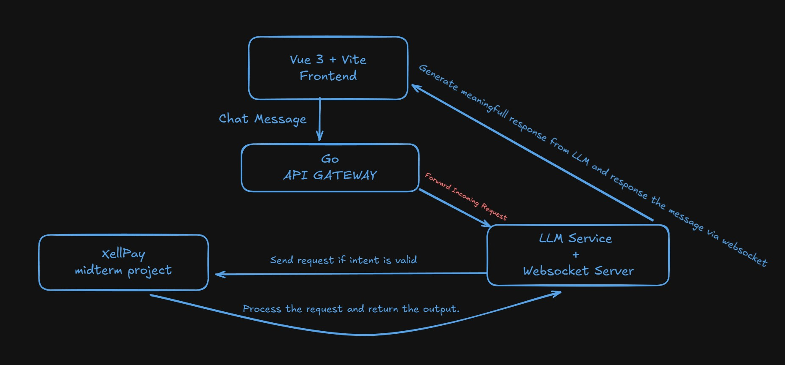

# Laravel ChatBot API (App B)

Bu proje, AI destekli bir sohbet uygulaması için Laravel 12 kullanılarak geliştirilmiş bir API servisidir.  
Sohbet mesajları işlenir, OpenAI ile entegre LLM analizleri yapılır ve XellPay (App A) API’si ile fatura işlemleri yürütülür.

---



---

## 🧠 Özellikler

- Laravel 12 (API-only yapı)
- Reverb ile WebSocket yayını
- OpenAI GPT-3.5 Turbo entegrasyonu
- Kullanıcı mesajına göre niyet (`intent`) ve parametre çıkarımı
- XellPay API (App A) ile veri paylaşımı
- Broadcast ile anlık AI yanıtları

---

## 📁 Proje Yapısı

```
se4458-chatapp/
├── app/
│   ├── Http/
│   │   ├── Controllers/Api/v1/AiMessageController.php
│   │   └── Requests/
│   ├── Events/MessageReceived.php
│   └── Services/LLMService.php
├── routes/
│   └── api.php
├── config/
│   └── services.php
├── .env.example
└── ...
```

---

## ⚙️ Ortam Değişkenleri (.env)

`.env.example` dosyasını `.env` olarak kopyalayın:

```bash
cp .env.example .env
```

### Gerekli Ayarlar:

```env
APP_NAME=ChatBotApp
APP_PORT=8001

# LLM
LLM_PROVIDER=openai
OPENAI_API_KEY=sk-xxxxxxxxxxxx
OPENAI_MODEL=gpt-3.5-turbo

# GSM App (App A)
GSM_APP_BASE_URL=http://xellpay.domain.com

# Reverb WebSocket
REVERB_APP_ID=...
REVERB_APP_KEY=...
REVERB_APP_SECRET=...
REVERB_HOST=localhost
REVERB_PORT=6001
```

---

## 🚀 Kurulum

```bash
composer install
cp .env.example .env
php artisan key:generate
php artisan migrate
```

---

## 🧪 Çalıştırmak

```bash
php artisan serve --port=8001
```

Ayrıca Reverb başlat:

```bash
php artisan reverb:start --port=6001
```

---

## 🧩 API Kullanımı

### AI Chat Endpoint:

```http
POST /api/v1/chat
Authorization: Bearer {token}

{
  "message": "Show me my bill for March 2025"
}
```

Yanıt olarak `response`, `intent`, ve AI’nın oluşturduğu metin döner.  
Ayrıca `MessageReceived` eventi ile WebSocket yayını yapılır.

---

## 🧠 LLMService Özellikleri

- `analyze($message)`: Kullanıcı mesajından `intent` ve `parameters` çıkarır
- `generateReply($intent, $params, $data)`: Veriye göre doğal dilde özet yanıt üretir
- `generateReplyFromError(...)`: Hatalar için özel yanıt üretir

---

## 🌐 Yayınlama (Supervisor + Nginx)

Supervisor ile WebSocket servisini arka planda çalıştır:

```ini
[program:reverb]
command=php artisan reverb:start --port=6001
directory=/var/www/se4458-chatapp
autostart=true
autorestart=true
stderr_logfile=/var/log/reverb.err.log
stdout_logfile=/var/log/reverb.out.log
user=www-data
```